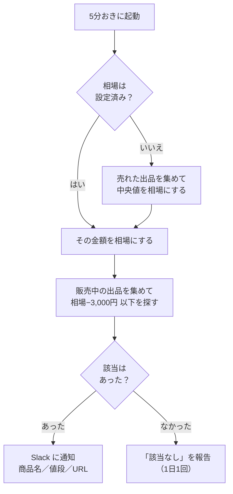

# price-drop-notifier

メルカリで**実際に売れた価格から相場を出し**、その相場より一定額安い出品が現れたら **Slack のマイチャット**に通知します。

GitHub の無料枠だけで動くので、**PC を閉じていても・電源を切っていても動き続けます**。
サーバーの用意も、常駐アプリも不要です。

現在の監視対象は **G-SHOCK GMW-B5000-1JF（新品・未使用のみ / 相場−3,000円）** です。

---

## まず動かす

手元の Mac / PC で、これだけです。

```bash
./run.sh verify
```

メルカリに繋がるか、Slack に届くかを順に試して、`✅` / `❌` で結果を出します。
`❌` のときは原因の切り分け（回線の問題か、メルカリに弾かれたか、Slack の設定か）まで表示します。

```
[1] 設定ファイル … OK（監視 1件が有効）
      - G-SHOCK GMW-B5000-1JF / 相場 100,000円（設定値） / 基準 −3,000円
[2] メルカリへの接続 …
      ✅ G-SHOCK GMW-B5000-1JF: 販売中 18件を取得
           95,000円  CASIO G-SHOCK GMW-B5000-1JF 新品未使用
[3] Slack への通知 …
      ✅ トークン方式で送信しました。Slack を確認してください
```

Slack の設定は `.env` に書いておけば読み込まれます。

```
SLACK_BOT_TOKEN=xoxp-...
SLACK_CHANNEL=U...
```

| コマンド | 何をするか |
| --- | --- |
| `./run.sh verify` | 疎通確認（まずこれ） |
| `./run.sh dry` | Slack に送らず結果だけ表示 |
| `./run.sh once` | 本番と同じ動作を1回だけ実行 |
| `./run.sh add` | 商品を追加（対話式） |
| `./run.sh test` | テストを実行 |

---

## 何をするか

5分おきに、監視対象ごとにこれを繰り返します。



### 相場の決め方

**相場を手で指定するのが推奨です。** `reference_price` に金額を書くと、売却実績の検索そのものをしなくなります。
リクエストが半分になるので動作が軽く、メルカリ側に弾かれる余地もその分だけ減ります。

```yaml
    reference_price: 100000   # この金額を相場として使う
    below_market_yen: 3000    # 97,000円以下なら通知
```

書かない場合は、売れた出品から自動で相場を出します。

* **平均ではなく中央値**を使います。付属品だけの出品やまとめ売りが数件混ざっても、相場が引っ張られないためです。
* 材料は**売り切れ・取引中**の出品です。「売れ残っている出品の希望価格」ではなく、**実際に売れた価格**を見ています。
* 売却実績が5件未満のときは相場を出さず、「相場を出せませんでした」と報告します。件数不足のまま相場を推定すると、誤検知の原因になるためです。

### 通知の中身

該当があったとき（依頼どおり 商品名／値段／URL）:

```
💰 G-SHOCK GMW-B5000-1JF — 相場より安い
商品名：CASIO G-SHOCK GMW-B5000-1JF 新品未使用
値段：95,000円（相場 100,000円 / −5,000円）
URL：https://jp.mercari.com/item/m12345678901
・相場 100,000円 より 5,000円 安い（売却 42件の中央値）
```

該当がなかったとき:

```
🔍 G-SHOCK GMW-B5000-1JF：該当なし
相場 100,000円（売却 42件の中央値 / 最安 94,000円）
基準 97,000円 以下の出品はありませんでした（販売中 18件を確認）
```

**「該当なし」は既定で1日1回だけ**送ります。5分おきに毎回送ると1日288通になってしまうためです。
ただし **Actions から手動実行したときは、該当が無くても必ず届きます**（動いているか確かめたい場面なので）。
毎回ほしい／一切いらない場合は `no_match_report` を `always` / `never` に変えてください。

### 同じ出品を何度も知らせない

一度知らせた出品は、**さらに値下げされるまで**再通知しません。
値下げされた場合は、新しい値段で改めて届きます。

---

## 「Claude in Chrome」ではなく GitHub Actions を使っている理由

Claude in Chrome（ブラウザ拡張）は、**PC が起動していてブラウザが開いている間しか動きません**。
「PC を閉じていても5分毎に確認したい」という要件は、拡張機能では原理的に満たせません。

そこで、GitHub が用意しているクラウド実行環境（GitHub Actions）で5分おきにスクリプトを走らせています。

---

## セットアップ

### 1. リポジトリを用意する

このディレクトリ一式を、自分の GitHub アカウントに **Public** リポジトリとして置きます。

```bash
tar xzf price-drop-notifier.tar.gz && cd price-drop-notifier
git init && git add . && git commit -m "初期実装"
# GitHub で Public の空リポジトリを作ってから
git remote add origin https://github.com/<あなた>/price-drop-notifier.git
git push -u origin main
```

> **Public を推奨する理由**: GitHub Actions は Public リポジトリなら**完全に無料・無制限**です。
> Private だと無料枠が月2,000分しかなく、5分おきの実行では1〜2週間で使い切って課金が始まります。
> Slack のトークンは Secrets に入れるのでコードを公開しても漏れませんが、
> `config/watchlist.yml` に書いた**商品名は公開されます**。それが困る場合は Private にしたうえで、
> ワークフローの `cron` を `*/20`（20分おき）などに緩めてください。

### 2. Slack の受け口を作る（マイチャットに届かせる）

1. <https://api.slack.com/apps> → **Create New App** → **From scratch**
   （名前は「価格ウォッチ」など、ワークスペースは自分のもの）
2. 左メニュー **OAuth & Permissions** を開く
3. **User Token Scopes** に `chat:write` を追加
   （**Bot** Token Scopes ではなく **User** のほうです。自分とのDM＝マイチャットに投稿するために必要）
4. ページ上部の **Install to Workspace** でインストールし、**User OAuth Token**（`xoxp-` で始まる）をコピー
5. 自分のメンバーIDを調べる
   Slack で自分のアイコン → **プロフィール** → 「⋮」→ **メンバーIDをコピー**（`U` から始まる文字列）

| やりたいこと | 追加するスコープの場所 | 取れるトークン | 届く場所 |
| --- | --- | --- | --- |
| **マイチャット（自分とのDM）** | **User** Token Scopes | `xoxp-…` | 自分とのDM |
| アプリからのDM | **Bot** Token Scopes | `xoxb-…` | アプリとのDM |
| チャンネル固定 | Incoming Webhook | Webhook URL | 指定チャンネル |

### 3. Secrets を登録する

リポジトリ → **Settings** → **Secrets and variables** → **Actions** → **New repository secret**

| 名前 | 値 |
| --- | --- |
| `SLACK_BOT_TOKEN` | 手順2の User OAuth Token（`xoxp-…`） |
| `SLACK_CHANNEL` | 自分のメンバーID（`U…`） |

> 変数名が `SLACK_BOT_TOKEN` ですが、ユーザートークン（`xoxp-`）を入れて問題ありません。

### 4. 動作を確認する

**Actions** タブ → 左の **price-watch** → **Run workflow**。

1. まず `dry_run` に ✅ を入れて実行 → Slack に送らず、ログで相場と該当件数を確認できます
2. 問題なければ ✅ を外して実行 → マイチャットに通知が届きます（該当が無ければ「該当なし」が届きます）
3. 以降は5分おきに自動で動きます

---

## 商品を追加する

**YAML を手で書く必要はありません。** 商品名と相場を渡すだけです。

```bash
./run.sh add
# または
python scripts/add_product.py --name "GMW-B5000-1JF" --price 100000 --below 3000
```

`config/watchlist.yml` に追記したあと必ず読み直して検証し、壊れていれば書く前の状態に戻します
（壊れた設定を残すと、次の自動実行ごと止まってしまうため）。

追加したら commit して push すれば、次の実行から有効になります。

```bash
git add config/watchlist.yml && git commit -m "GMW-B5000-1JF を追加" && git push
```

現在の設定はこうなっています。

```yaml
watches:
  - name: "G-SHOCK GMW-B5000-1JF"
    mode: market
    keyword: "GMW-B5000-1JF"
    exclude_keyword: "ベルト バンド コマ ケース 箱のみ 保護フィルム フィルム ジャンク 部品 説明書 タグ"
    item_condition: [1]   # 新品、未使用のみ
    price_min: 20000      # 付属品だけの出品を相場計算から外す
    below_market_yen: 3000
    # reference_price: 100000   # 相場が決まったらここに書く
```

### 設定できる項目

| キー | 既定値 | 意味 |
| --- | --- | --- |
| `name` | 必須 | 通知に出る名前。価格の記憶もこの名前で紐づく |
| `keyword` | 必須 | メルカリの検索窓に入れるのと同じ文字列 |
| `reference_price` | なし | 相場（円）。書くと売却実績の検索をしなくなる（推奨） |
| `exclude_keyword` | 空 | 除外語（スペース区切り） |
| `item_condition` | 全部 | `[1]`=新品、未使用 / `[1,2]` なら「未使用に近い」も含む<br>3=目立った傷や汚れなし 4=やや傷や汚れあり 5=傷や汚れあり 6=状態が悪い |
| `below_market_yen` | `3000` | 相場から何円安ければ通知するか |
| `market_sample_size` | `60` | 相場の計算に使う売却実績の件数（最大120） |
| `min_samples` | `5` | これ未満の売却実績しか取れなければ相場を出さない |
| `no_match_report` | `daily` | 該当なしの連絡。`daily` / `always` / `never` |
| `price_min` / `price_max` | なし | 相場計算と検索から外す価格帯 |
| `cooldown_minutes` | `360` | 同じ出品への再通知を空ける間隔 |
| `max_results` | `60` | 販売中を何件まで見るか（最大120） |
| `enabled` | `true` | `false` で一時停止 |

商品を増やすときは `watches:` にもう1件追加するだけです。

なお `mode: keyword`（相場を見ず、値下がりや目標価格で通知）と `mode: item`（特定の1出品を追う）も残してあります。

---

## 手元で動かす（詳細）

`./run.sh` が中でやっていることは、これです。

```bash
python -m venv .venv && source .venv/bin/activate
pip install -r requirements-dev.txt

python -m src.main --verify          # メルカリと Slack に繋いで診断
python -m src.main --check --dry-run # 設定の文法チェックだけ（ネットワークなし）
python -m src.main --dry-run         # 取得して結果だけ表示（送らない・保存しない）
pytest -q
```

**相場を自動算出にする場合**、設定を書く前に目で確かめられます。

```bash
python scripts/probe.py market GMW-B5000-1JF --condition 1 --price-min 20000 --below 3000
```

```
売却実績: 42件 / 販売中: 18件
相場（中央値）: 100,000円  [最安 94,000円 / 最高 110,000円 / 母数 42件]
通知の基準: 97,000円 以下
```

相場が明らかにおかしい（付属品が混ざっている等）ときは、`--exclude` や `--price-min` を調整してから
`config/watchlist.yml` に反映してください。

その他:

```bash
python scripts/probe.py search "GMW-B5000-1JF"   # 検索結果の一覧
python scripts/probe.py item m12345678901        # 出品1件の価格
SLACK_BOT_TOKEN=xoxp-... SLACK_CHANNEL=U... python scripts/probe.py slack  # テスト通知
```

---

## 運用するうえで知っておくこと

* **5分ちょうどには来ません。** GitHub Actions のスケジュール実行は混雑時に数分〜十数分ずれます（GitHub の仕様で、こちらでは制御できません）。
* **メルカリ側の都合で止まることがあります。** GitHub Actions の実行サーバーはデータセンターのIPなので、アクセス制限を受ける可能性があります。**この点は実際に動かすまで確認できません。**6回連続（≒30分）で失敗した時点で Slack に通知が来るので、そのときは `python scripts/probe.py market …` を手元で実行して切り分けてください。
* **ブロックされた場合の移し替えは容易です。** 価格取得・判定・通知は素の Python で、GitHub 固有なのはワークフローファイル1枚だけです。ラズパイや VPS の cron に移せば、家庭用回線のIPから実行できます。
* **60日ルールを気にしなくてよい。** GitHub は60日間コミットのないリポジトリのスケジュール実行を止めますが、この仕組みは実行のたびに `state` ブランチへ push するため、止まりません。
* **アクセスは控えめに。** 監視する商品を増やすほどリクエストが増えます。5分間隔なら数件〜十数件程度に留めるのが無難です。
* メルカリの利用規約には自動化されたアクセスを制限する条項があります。個人の買い物のために低頻度で確認する用途を想定しています。

---

## 困ったときは

| 症状 | 確認すること |
| --- | --- |
| どこで詰まっているか分からない | まず `./run.sh verify`。原因の切り分けまで表示します |
| 「相場を出せませんでした」が続く | `reference_price` に相場を直接書くのが一番確実です。自動算出のままなら `item_condition` を `[1,2]` に広げるか `min_samples` を下げる |
| 相場が安すぎる／高すぎる | 付属品や別モデルが混ざっている。`exclude_keyword` と `price_min` を調整 |
| 通知が来ない | 該当が無いだけの可能性。手動実行（`Run workflow`）すれば該当なしでも必ず届くので、それで疎通確認できる |
| Slack が `channel_not_found` | `SLACK_CHANNEL` はチャンネル名ではなく**メンバーID**（`U` 始まり） |
| Slack が `not_in_channel` | Bot トークンでチャンネルに送る場合は、そのチャンネルにアプリを招待する |
| マイチャットに届かない | `xoxb-`（Bot）ではなく `xoxp-`（**User** Token Scopes の `chat:write`）を使う |
| `HTTP 403` が続く | メルカリ側のアクセス制限。しばらく待つか、監視件数を減らす。続くようなら実行場所の移設を検討 |
| 通知が多すぎる | `below_market_yen` を上げる、`cooldown_minutes` を長くする |
| 価格の記憶をリセットしたい | `state` ブランチを削除する（次回の実行で作り直されます） |

---

## 構成

```
run.sh                              手元で動かすための入り口
scripts/add_product.py              商品名と相場を渡すだけで監視を追加する
.github/workflows/price-watch.yml   5分おきの実行と、state ブランチへの保存
config/watchlist.yml                監視する商品（ここだけ編集すれば運用できる）
src/main.py                         全体の流れ / --verify の診断
src/sources/mercari.py              メルカリの価格取得（DPoP 署名つきAPI + HTML保険）
src/engine.py                       相場の算出と該当判定
src/models.py                       相場・通知のデータ構造
src/state.py                        価格の記憶
src/notify/slack.py                 Slack 通知
scripts/probe.py                    デバッグ用
tests/                              ネットワーク不要のテスト（145件）
```

前回の価格と「該当なしを最後に報告した時刻」は `state` ブランチに `state.json` として保存されます
（親を持たない単一コミットを毎回上書きするので、5分おきに動かしても履歴は増えません）。

メルカリ以外のサイトを足す場合は、`src/sources/` に `search` / `search_sold` / `fetch` を持つクラスを追加して
`src/sources/__init__.py` の `REGISTRY` に登録するだけで、相場計算と通知はそのまま使えます。
